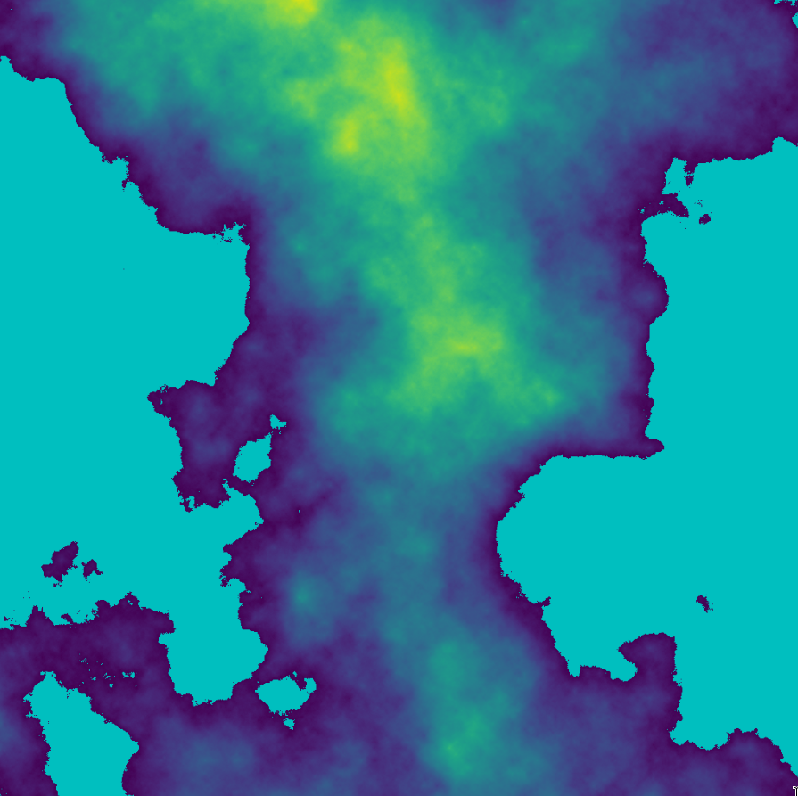

# Diamond-Square in Python

## Description

This is an implementation of the Diamond-Square algorithm for heightmap
generation, using python's numpy library.

## Usage

I use the kitty terminal which has a "kitten" called icat which I use for
rendering images. So I simply pipe my python script to icat as follows:

```./diamond_square.py -w 10 | kitten icat```

You can use any other software that takes binary images from stdout (`feh`, for
instance).

For further details on the usage, checkout the command line help
```./diamond_square.py -h```, or simply read the code.

## Example


